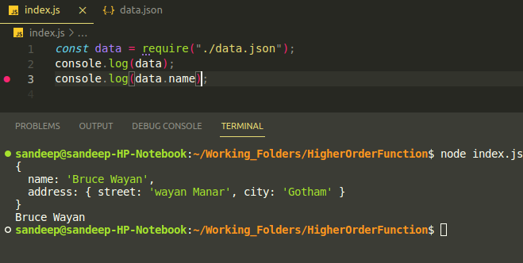
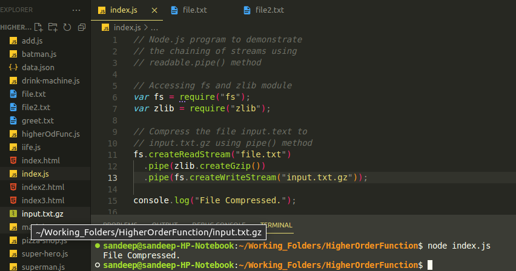

## What is Node.js?

Node.js an open-source , cross-plateform javascript runtime envirnment.

- open source:- source code is publicly available for sharing and modification.

- Cross plateform- Available on Mac, Windows and Linux.

- Javascript runtime environment-?

#### Why learn Node.js?

- Build end-in-end JavaScript applications.
- A number of major companies like LinkedIn,Netfilx, PayPal have al migrated from other backend technologies to Node.js.
- Full stack delevelopment is the one of the most sought out skill sets by companies.
- Huge community supports.


### Browser vs Node.js

- In the browser, most of the time what are doing is interacting with the DOM, or other Web Platform APIs like Cookies. You dont have the document, window and all other objects that are provided by the broswer.
- In the browser, we dont have all the nice API that Node.js provides througth its modules. For example the filesystem access functionality.

- With Node.js you control the envirnment.
- With a broswer, you are at the mercy of what the users choose.

### Modules

A module is an encapsulated and reusable chunk of code that has its own context in Node.js, each file is treated as a separate modules.

### Types of Modules

- **Local modules** - Modules that we create in our applicatios

- **Build-in modules** Modules that Node.js ships with out of the box.

- **Third party modules** Modules written by other developers that we can use in our applicatios.

Local modules:- Moduules that we create and use
in our application.

### CommonJS

- CommanJS is a standard that states how a modules should be structured and shared.

- Node.js adopted CommonJS when it started out and is what you will see in code bases.

  

  

### Local Modules Summary

- In node.js, each file is a module that is isolated by default.
- To load a module into another file, we use require function
- When index.js is executed, the code in the module is also executed.
- if the file we are requiring is a javascript file, we can skip specifying the extension and node.js will infer it on our behalf.

### Module Exports


**Note** You can use multiple time of add functions

### Module Scope


**Note** each module in node.js has a own scope.


#### Immediately Invoked Function (IIFE) in Node.js


- Before a module's code is executed, Node.js will wrap it with a function wrapper that provides scope.

- This saves us from having to worry about conflicting variables or functions.

- This is proper eccapsulatios and reusability is unaffected.

### Module Wrapper

- Every module in node.js get wrapped in an IIFE before being loaded.

- IIFE helps keep top level variables scoped to the modules rather than the global object.

- The IIFE that wraps every modules contains 5 parameters which are pretty important for the functioning of a module.
  

  

**Before a module's code is executed node.js will wrap it with a functions that contain five parameter namely exports,requre,module,filename,dirname.**

### Module Caching


**Note** When you create new superhero the module are not going to function because module already caching in previous supername of name.
That is called module caching come to the picture.

### Import Export pattern.

**There are five ways to import and export pattern in javascript**

**1** - In first way to create a module as a single functions. using **module.export=functionName**

**Example**


**2 Pattern**

Here we just put directly module.exports in the function name. and all remaining are same.


**3rd Pattern**

We are going to export two function, one is add and second is subtruct.
In this program we are retuning as a object, then object you have to call .(dot) operator.


**4th Pattern**

:- We are going to directly in the function name like as module.export.functionName
means, how to attach the module.exports in the function?


**5th Pattern**

:- IIFE node.js module recieved 5 modules in javascript
name as like as when you call IIFE function. In export function have already a module , so no need to putting modules.exports instead of exports.functionName.


Why are you putting exports.add instead of moudule.exports.add


### Importing Json

- JavaScript object Notation
- A data interchange format commonly used with web server.




You can print any data based on your requirement.

### Watch mode in node.js

js server using the --watch flag, run the node command with the --watch flag followed by the name of the file you want to restart when Node detects changes. The command will watch your server. js file and restart the Node. js server when it detects changes made in the file


If any require to change in your code then no need to run command watch mode detect automatically your code. and give the output based on your function call.
**Just save it.**


### Build-in-Module

Modules that node.js ships with Also referred to as core modules

Import the module before you can use it.

- path
- events
- fs
- stream
- http

### 1- Path module

The path module provides utilities for working with file and directory path.


In this above example **filename give us to absolute path and** dirname give us absolute dirctory name.

Differnce method available in path module.


In this above example if you run this program you will find a baseName of the file name which are using **path.basename(\_\_filename)**

and **path.extname(\_\_filename)** give us the extension of file name but directory name does not have any extension, he will given to empty.

and **path.parse(\_\_filename)** method give us to inform of object every information of the pathname.

and **path.format(path.parse(\_\_filename))** give us the absolute path of filename.

Some remaining method are:-


In above example have isAsolute method which are given is it absolute are not.

and join method also there to join all arguments and normalize the resulting path.

**Last and important method**


**Both these methods accept a sequence of paths or path segments.**

**The path.resolve() method resolves a sequence of paths or path segments into an absolute path.**

**The path.join() method joins all given path segments together using the platform specific separator as a delimiter, then normalizes the resulting path.**

### Callback Pattern

- In JavaScript, functions are first class objects.

- A function can be passed as an arguments to function.

- A function can be also be returned as values from another functions.


**Type of callback functions**

- Synchronous
- Asynchronous

A callback which is executed immediately is callled a synchronous callback.

Asynchronous:- A callback that is often used to continue or resume code execution after an asynchronous operation has completed.

callback are used to delay to execute of a function until particuler time or event has occurred.

In node.js have an asynchronus nature to prevent blocking of execution.

**Example** reading data from a file, fetching data from a database or holding a network request.

**Asynchronous callback in brower**


### Events Module

- The events module allows us to work events in node.js

- An events is an action or an occurrence that has happened in our application that we can respond to.

- Using the events module, we can dispatch our custom events and respond to those custom events in a non-blocking manner.

### Events Module- Scenario

- Let's say you are feeling hungry and head out to Dominos to have pizza.

- At the counter, you place your order for pizza

- When you place the order, the line cook sees the order on the screen and bakes the pizza for you.

- Order being placed int the events

- Baking a pizza is a responce to that event


**Note**

- The events module is a build-in module that allow us to work with events in node.

- The module return an events emitter class which we can it instantiate to create an emitter object


- Using emitter object we can register event listner that on method and emit method accept the event name followed by arguments that need to passed on the listener.

- when events occurs node automatically call the listner for the corresponding event passing in appropriate agruments.

- Events allow us to code non-blocking manner.

### Extending from EventEmitter

How to build your own event Emitter?


### Stream and Buffers

**Stream**

- A Stream of a sequence of data that is being moved from one point to another over time.

- Ex: A Stream of data over the internet being moved from one computer to another.

- Ex: A Stream of data being transferred from one file to another within the same computer.

- Process Stream of data in chunk as they arrive insted of waiting for the entire data to be availble before processing.

Ex: Watching a video on Youtube.

The data arrive in chunks and you watch in chunks while
the rest of data arrive over time.

Ex: transferring file contents from fileA to fileB

- The content arrive in chunks and you transfer in chunks while the remaining contents arrive over times

- prevent unnecessary data downloads and memory usags.

### Buffer

- Area where people wait is nothing but the buffer.

- Node.js can not control the pace at which data arrives in the stream.

- It can only decide when it is write time to send the data for processing.

- If data is already processed or too tittle data to process, node put the arriving data in a buffer.

- It is intentionally small area that maintains in the runtime to process a stream of data.

- Ex: streaming a video online.

- if your internet connection is fast enough, the speed of stream will be fast enough to instantly fill up the buffer and send it out for processing.

- that will repeat till the stream is finished.

- If your connection is slow, after processing the first chunk of data that arrived, the video player will display a loading spinner which indicates it is waiting for more data to arrive.

- one the buffer is filled up and the data is processed, the video player show the video.


### Asynchronous JavaScript

Javascript is a synchronous, blocking, single-threaded langage.

**Synchronous**

- if we have two function which log message to the console, code execute top down, with only one line executing at any given time.


**Blocking**

No matter how long a previous process takes, the subsequent processes won't kick off until the formar is completed.

Web app runs in a browser and it executes an intensive chunk of code without returning control to the browser, the browser can appear to be forzen.

**Single-threaded**
A thread is simple a processes that your JavaScipt program can use to run a task.

Each thread can only do one task at a time.

Javascript has just the one thread called main thread for executing any code.

### Important

Just javascript is not enough

- we need new pieces which are outside of javascript to help us write asynchrounos code

- for front-end, this is where web browser come into play for back-end, this is where Node.js come into play.

- Web browers and node.js define function and APIs that allow us to register function that should not be executed synchrononsely, and should instead be invoked asynchronously when some kind of event occurs

- For example, that could be a passage of time (settimeout or setInterval), the users interaction with the mouse over the network (callback, Promises,async-await)

- You can let your code do several things at the same time without stoping or blocking your main thread.

### fs Module

the file system (fs) allow you to work with the file system on your computer.

;

### fs Promise Module


We can use another approch called as await.


### Streams

- A stream is a sequence of data that is being moved from one point to another over time.

- Ex: a stream of data being transferred from one file to another with in the same computer.

- Work with data in chunks instead of writting for the entire data to be available at once.

- If you're transferring file contents from fileA to fileB, you don't wait for entire fileA content to be saved in temporary memory before moving it into fileB

- Instead, the content is transferred in chunks over time which prevents unnecessary memory usage.

- Stream is infact a build-in node module that inherits from the events emiiter class

- Others modules internally use streams for there functioning.


### Types of Streams

- Readable stream from which data can be read.

- Writable stream to which we can write data.

- Duplex streams that are both Readable and Writable.

- Transform streams that can modify or transform the data as it is written and read.

- Ex: Reading from file as readble stream
- Ex:- Written to a file as writable stream.
- Ex:- Sockets as a duplex stream.

### Node.js Stream readable.pipe() Method


The readable.pipe() method in a Readable Stream is used to attach a writable stream to the readable stream so that it conseqently switches into flowing mode and then pushes all the data that it has to the attached Writable.

```
readable.pipe(destination,option)
destination: This parameter holds the destination of writing data.
option: This parameter holds the pipe options.
```


So, after the piping method the file named file2.text” must contain the data that was in the file file.text”.



### HTTP

- Hypertext Transfer Protocal
- A protocal that defines a format for client and server to speak to each other.
- The client send HTTP request and server responds with HTTP response.

### HTTP and Node

- We can create a web server using Node.js
- Node.js has access to operating systems functionality like networking.
- Node has an event loop to run task **asynchronously** and is perfect for creating web servers that can simultaneously handel large volumes of requests.
- The node server we create should still respect the HTTP format.
- The HTTP module allows creating of web servers that can transfer data over HTTP.

### How to create a server in node.js


### JSON Response


### HTML Response


### How to send a response to external HTML file


### HTML Routing

**Routing refers to how an application's endpoints (URIs) respond to client requests.**


### Web framework

- A framework simpley abstruct the low level code allowing you to focus on the requirement than the code itself.

- for example, Angular, React, Vue are the framework/libraries that help you build user interface without having to rely on the lower level DOM API in JavaScript.

- There are frameworks to build web or mobile aplication without having a rely on the HTTP module in node.js

- Ex: express,nest,hapi,kao and sails

- They build on top of the HTTP module making it easier for you to implement all teh features.

### libuv

- libuv is a cross plateform open source libraby written in c language.

**Why**

- Handles asynchronous non-bocking operations in Node.js

**How?**

- thread pool
- Event loop

### Thread Pool
